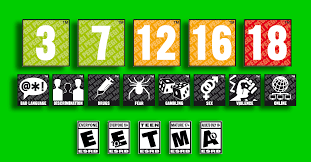

# Conocer el pegi

## Introducción
En este proyecto quiremos conocer el pegi (Pan European Game Information) de los juegos para poder dedicir a que juegos que se puede jugar por las edades.

### Recursos necesarios

Para este proyecto necesitmos tener instaladas las librerías:

          Pandas

          Beatifulsoup4

          Requests

          Json

Hemos cutilizado una dataset de [Kaggle](https://www.kaggle.com/) llamado [SALES OF VIDEO GAMES](https://www.kaggle.com/arslanali4343/sales-of-video-games).

Hemos usad la  [PEGI](https://pegi.info/) para obtener los pegi.
